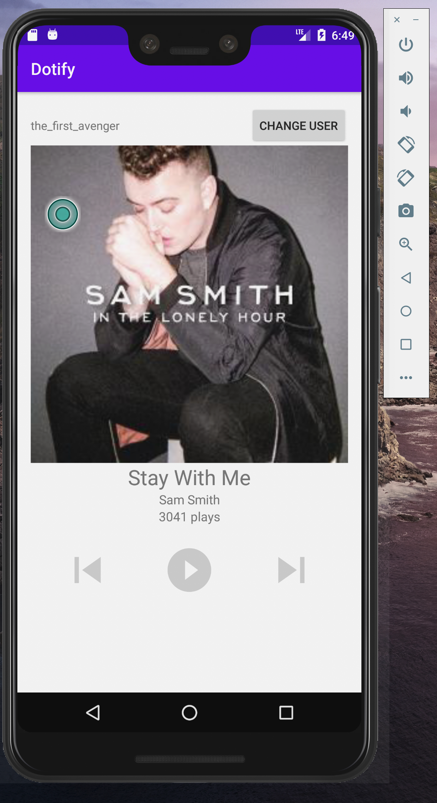

# HW2 - Dotify by Molly Li

This app will display a song list that's retrieved from SongDataProvider using RecyclerView. There are song titles, the artists' names and album image in the list. At the bottom of the list, there will also be a "Shuffle" button that allows you to shuffle the order of the songs. When you click the song displayed at the bottom, it will lead you to another page using Activities. 

On the next page, it'll generate a random number and when user clicks on play button, it will add the random number by one. Additionally, when the user clicks the previous and next button, it'll display a toase message. User can also change the user name by clicking the button "CHANGE USER" and when user is done changing, they can simply click the button "APPLY."

### Extra Credit

None 

### Screenshots

